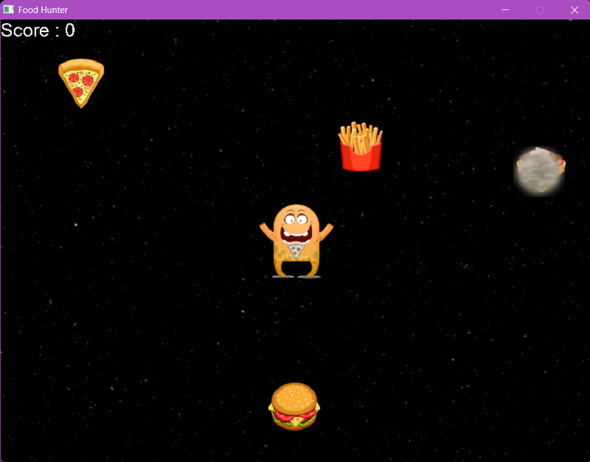
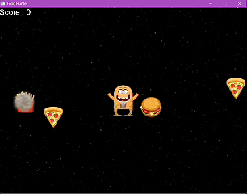

# 🍔 Space Food Hunter
A 2D arcade game built with SDL2 where players collect the correct food while avoiding incorrect items. This project was created to explore game development fundamentals in C, including real-time rendering, sprite animation, audio integration, collision detection, and event-driven programming.

## 📖 Overview
Food Hunter is a small arcade-style game developed to explore how multiple SDL2 libraries can be combined to create an interactive game experience.

The player controls a food hunter navigating a space-themed environment while collecting the requested food item displayed above the character. Correct selections increase the score, while incorrect choices decrease it. Throughout the game, food items move independently and periodically change direction, creating a simple but engaging gameplay loop.

## 💡 Why I Built This
After experimenting with SDL2 graphics, I wanted to challenge myself by creating a complete mini-game rather than another graphical demonstration. This project allowed me to explore how rendering, animation, collision detection, audio, and user interaction work together to form a simple but interactive arcade experience.

## ✨ Features
- 🎮 Keyboard-controlled character movement
- 🍕 Dynamic food spawning
- 🧠 Random target food selection
- 🚀 Moving food with randomized directions
- 💥 Visual smoke effect when food changes direction
- 🔊 Sound effects for correct and incorrect selections
- 🖼️ Sprite rendering using SDL2_image
- 🔤 Real-time score display using SDL2_ttf
- 🎵 Audio playback using SDL2_mixer
- 📈 Score tracking system

## 📸 Screenshots
### Gameplay
<p align="center">
  
</p>

### Collecting the Correct Food & the Wrong Food
<p align="center">
  
</p>

## 🛠️ Tech Stack
Language: C 

Graphics: SDL2 

Image Loading: SDL2_image 

Audio: SDL2_mixer 

Text Rendering: SDL2_ttf 

IDE: Visual Studio Code 

## ⚙️ Quick Start
This section explains how to set up, build, and run **Food Hunter** on Windows using **MSYS2 UCRT64** and GCC.
---
### Install the required tools
Before building the game, install:
- [Visual Studio Code](https://code.visualstudio.com/)
- [MSYS2](https://www.msys2.org/)
- The Microsoft **C/C++** extension for Visual Studio Code

Install MSYS2 in its default location:
```text
C:\msys64
```
After installation, open the **MSYS2 UCRT64** terminal.

> Use the **UCRT64** terminal rather than the plain MSYS terminal.
---
### Update MSYS2

In the MSYS2 UCRT64 terminal, run:
```bash
pacman -Syu
```

If MSYS2 asks you to close the terminal, close it, reopen **MSYS2 UCRT64**, and run the same command again:
```bash
pacman -Syu
```
---
### Install GCC and the build tools
Install the UCRT64 compiler toolchain:
```bash
pacman -S --needed base-devel mingw-w64-ucrt-x86_64-toolchain
```

When this message appears:
```text
Enter a selection (default=all):
```

press **Enter** without typing anything.

Verify that GCC was installed:
```bash
gcc --version
```
---
### Install the SDL2 libraries
Food Hunter uses SDL2 for graphics together with image, audio, and text-rendering extensions.

Install all required libraries:
```bash
pacman -S --needed mingw-w64-ucrt-x86_64-SDL2 
pacman -S --needed mingw-w64-ucrt-x86_64-SDL2_image
pacman -S --needed mingw-w64-ucrt-x86_64-SDL2_ttf
pacman -S --needed mingw-w64-ucrt-x86_64-SDL2_mixer
```

Verify the installation:
```bash
pkg-config --modversion sdl2
pkg-config --modversion SDL2_image
pkg-config --modversion SDL2_mixer
pkg-config --modversion SDL2_ttf
```

Each command should display an installed version number.
---
### Clone the repository
Clone the project from GitHub:
```bash
git clone https://github.com/YOUR_USERNAME/space-food-hunter.git
```

Move into the repository:
```bash
cd space-food-hunter
```

Replace `YOUR_USERNAME` with your actual GitHub username.
Alternatively, download the repository as a ZIP file and extract it.
---
### Build the game

From inside the project directory, run:
```bash
gcc foodhunterg.c -o food-hunter.exe \
$(pkg-config --cflags --libs sdl2 SDL2_image SDL2_mixer SDL2_ttf)
```

This command:
- Compiles `foodhunterg.c`
- Links the SDL2 libraries
- Creates `food-hunter.exe`
If the command finishes without an error, the build was successful.
---
### Run the game
Start the executable:
```bash
./food-hunter.exe
```
The game window should open.
> Run the executable from the repository's main folder so the game can locate the `media` directory.
---
## 🎮 Controls
⬆️ : Move Up
⬇️ : Move Down
⬅️ : Move Left
➡️ : Move Right
Close Window: Exit game

Move the hunter toward the food item shown on the character.
- Collecting the correct food increases the score.
- Collecting the wrong food decreases the score.
- Sound effects provide feedback for correct and incorrect choices.

## 📚 Challenges
One of the main challenges was coordinating several SDL libraries simultaneously. Graphics, fonts, images, timers, and audio all required separate initialization and cleanup routines while remaining synchronized within the main game loop.

Another challenge involved managing moving food objects and ensuring collision detection remained responsive without affecting overall game performance.

## 🚀 Future Improvements
- Main menu
- Game over screen
- High score saving
- Multiple difficulty levels
- Additional food types
- Health system
- Background music
- Pause menu

## 🧩 Common Issues

### Issue 1: `SDL2/SDL.h: No such file or directory`

SDL2 or the matching UCRT64 development package is missing.

Reinstall the required libraries:

```bash
pacman -S --needed \
mingw-w64-ucrt-x86_64-SDL2 \
mingw-w64-ucrt-x86_64-SDL2_image \
mingw-w64-ucrt-x86_64-SDL2_mixer \
mingw-w64-ucrt-x86_64-SDL2_ttf
```

---

### Issue 2: `undefined reference to SDL...`

The source file compiled, but the SDL libraries were not linked.

Use the complete build command:

```bash
gcc foodhunterg.c -o food-hunter.exe $(pkg-config --cflags --libs sdl2 SDL2_image SDL2_mixer SDL2_ttf)
```

Do not compile using only:

```bash
gcc foodhunterg.c -o food-hunter.exe
```

That command does not link SDL2.

---

### Issue 3: The game opens but images, sounds, or text are missing

Confirm that:

- The `media` folder is present.
- The executable is being run from the repository root.
- Filenames and capitalization have not been changed.

### Issue 4: `gcc` is not recognized

Add the following directory to your Windows `Path`:

```text
C:\msys64\ucrt64\bin
```

Then restart Visual Studio Code.

You may also build directly inside the **MSYS2 UCRT64** terminal without changing the Windows PATH.

---

### Issue 5: VS Code shows red lines under SDL headers

Open the Command Palette:

```text
Ctrl + Shift + P
```

Run:

```text
C/C++: Reset IntelliSense Database
```

Then reload Visual Studio Code.

Your `.vscode/c_cpp_properties.json` should use:

```json
{
  "configurations": [
    {
      "name": "UCRT64",
      "compilerPath": "C:/msys64/ucrt64/bin/gcc.exe",
      "includePath": [
        "${workspaceFolder}/**"
      ],
      "cStandard": "c17",
      "cppStandard": "c++17",
      "intelliSenseMode": "windows-gcc-x64"
    }
  ],
  "version": 4
}
```
---
## ✅ Setup Complete
Once the game window opens and the character responds to the arrow keys, the setup is complete.
Have fun collecting food—and experimenting with SDL2 game development!
